# 💳 EasyPay Wallet (EWMS)

  
<i>A modern e-wallet application prototype simulating the complete flow of a digital payment system</i>

---

## 📱 Overview

EasyPay is a comprehensive e-wallet prototype that demonstrates the core functionality of modern digital payment platforms, from user authentication to various payment types including a special Kolkata Metro booking feature.

## ✨ Core Features

### 🔐 Authentication
Complete authentication flow with mobile number verification, OTP simulation, and 4-digit PIN security.

### 💰 Wallet Actions

| Feature | Description |
|---------|-------------|
| **Add Money** | Top up your wallet balance via dummy card or development mode |
| **Send Money** | Transfer funds to other users using mobile number |
| **Pay Merchants** | Simulate merchant payments with merchant ID |
| **Bill Payments** | Pay mobile recharges, electricity, and water bills |
| **Metro Booking** | Book Aamar Kolkata Metro tickets with QR code generation |

### 📊 Transaction History
Searchable and filterable list of all past transactions with detailed records.

### 🔒 Security
PIN verification required for sensitive transactions like money transfers and bill payments.

## 🛠️ Tech Stack

- **Frontend:** ReactJS (Vite)
- **Backend:** Supabase
- **Styling:** Tailwind CSS
- **Routing:** React Router
- **Icons:** Lucide React

## 📸 Prototype Showcase

### 1. Authentication Flow

  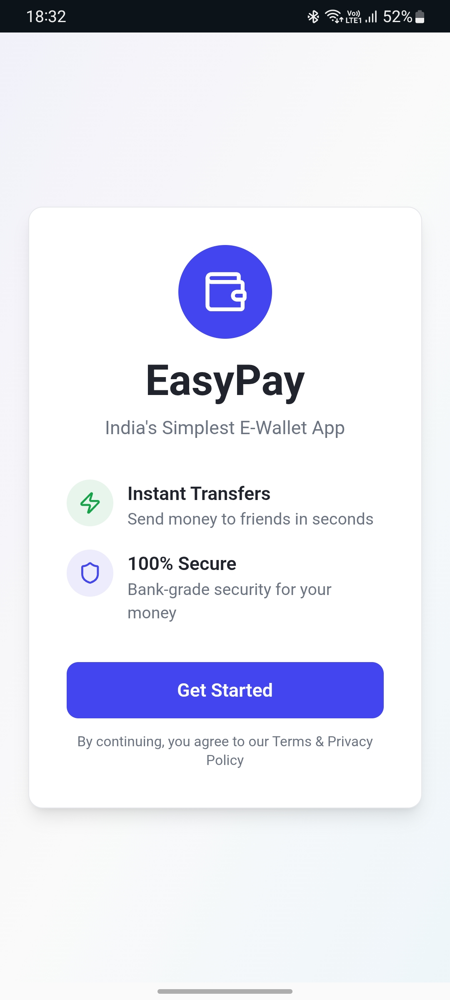
  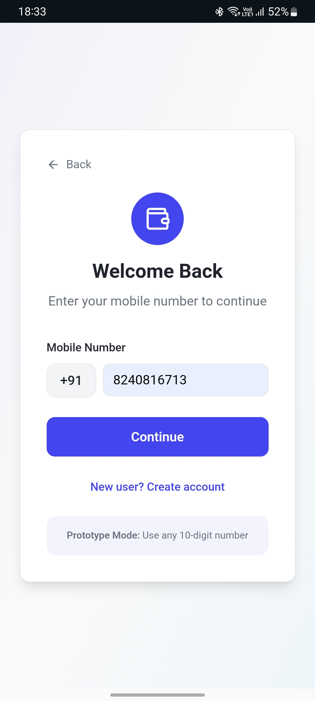
  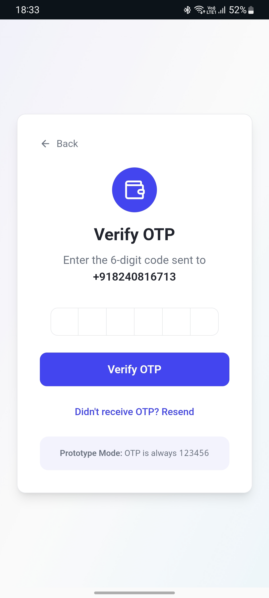
  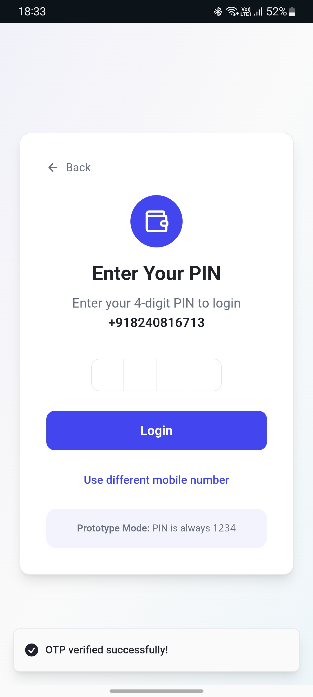

### 2. Dashboard & Core Features

  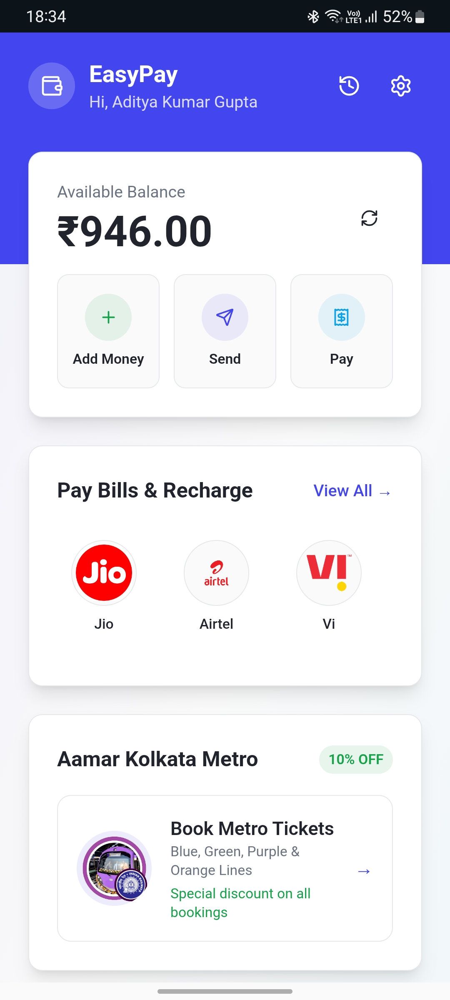
  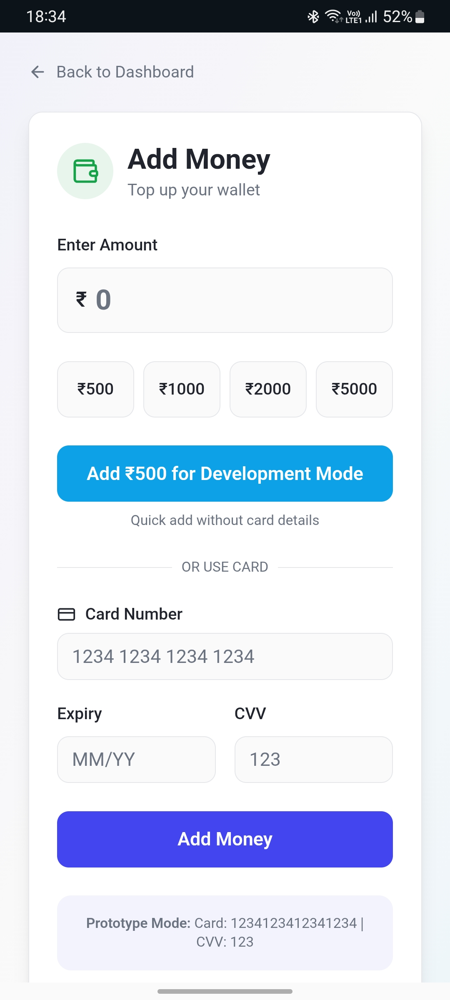
  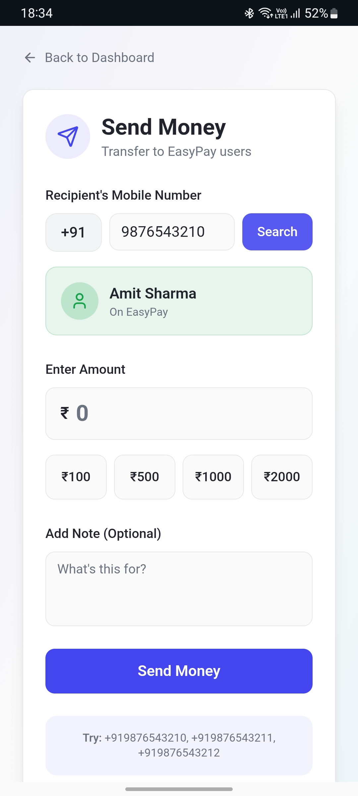

### 3. Payment Options

  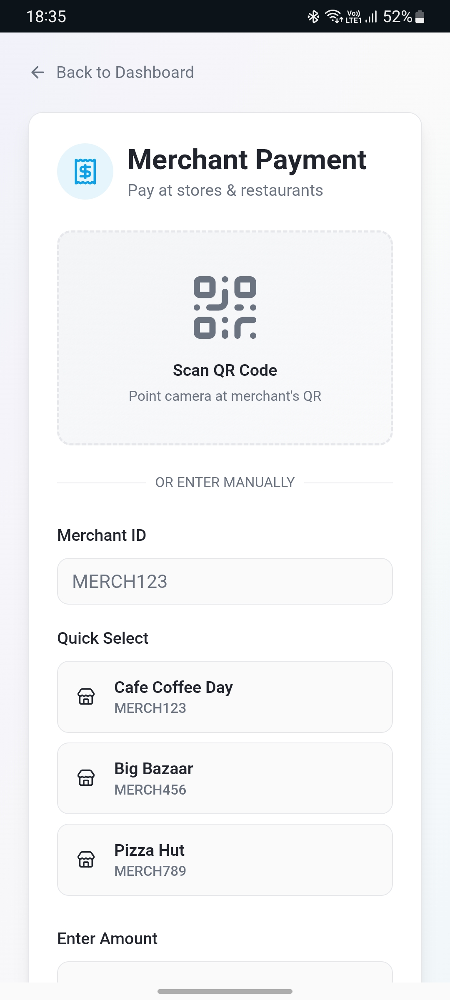
  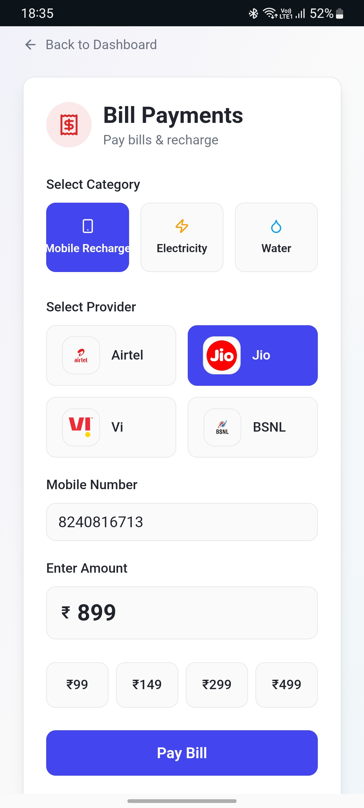
  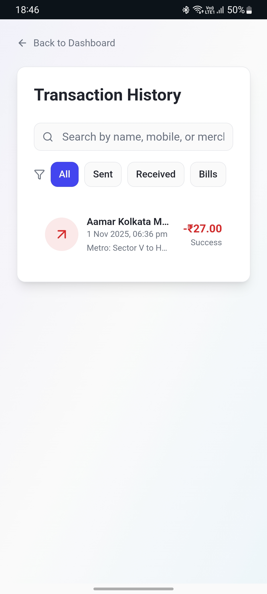

### 4. Metro Booking Feature

  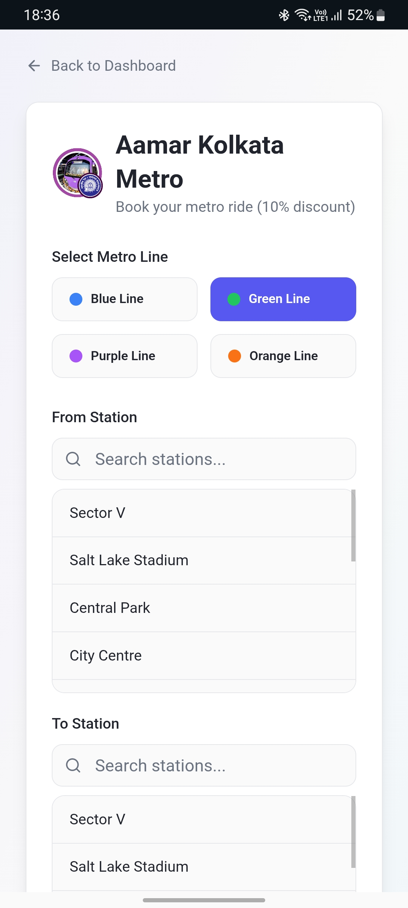
  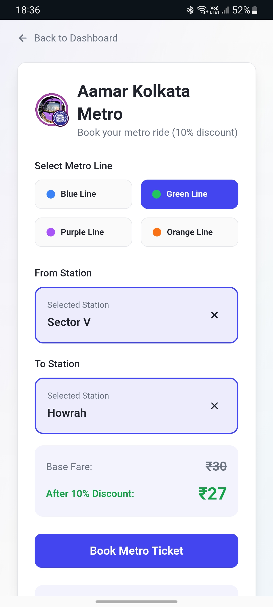
  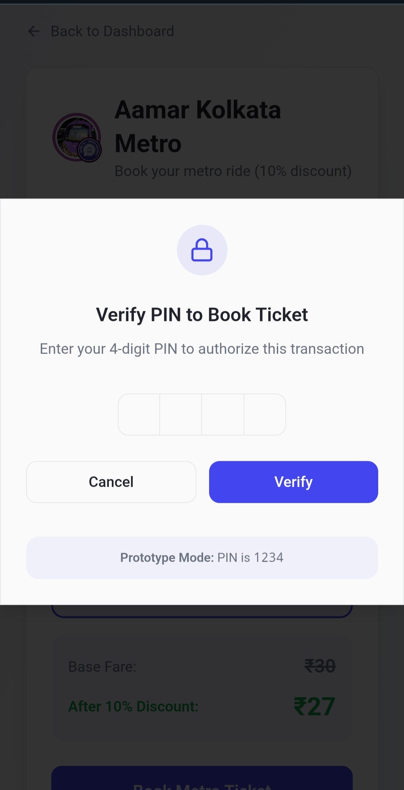
  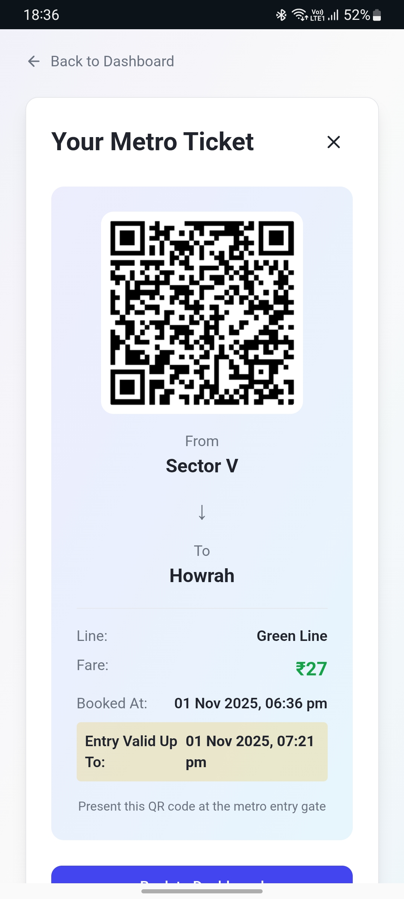

## 🧪 Testing the Prototype

This is a demo environment with simplified features for testing purposes.

### 🔑 Login Credentials

| Field | Value |
|-------|-------|
| **Mobile Number** | Any 10-digit number |
| **OTP** | `123456` |
| **PIN** | `1234` |
| **Starting Balance** | ₹1,000.00 |

> **Note:** You can skip the KYC step or simply enter a name after signup.

### 💵 Add Money Options

**Quick Development Mode:**
- Click "Add ₹500 for Development Mode" button

**Dummy Card Details:**
- **Card Number:** `1234 1234 1234 1234`
- **CVV:** `123`
- **Expiry:** Any future date

### 👥 Test Send Money Recipients

Use these mobile numbers to test money transfers:
- `+919876543210`
- `+919876543211`
- `+919876543212`

### 🏪 Test Merchant IDs

- `MERCH123` — Cafe Coffee Day
- `MERCH456` — Big Bazaar
- `MERCH789` — Pizza Hut

## 🎯 Key Highlights

- **Realistic Flow:** Complete user journey from registration to transaction
- **Metro Integration:** Special feature for Kolkata Metro ticket booking with 10% discount
- **QR Code Generation:** Dynamic QR codes for metro tickets
- **Transaction Management:** Comprehensive history with search and filter options
- **Secure Transactions:** PIN-based verification for sensitive operations